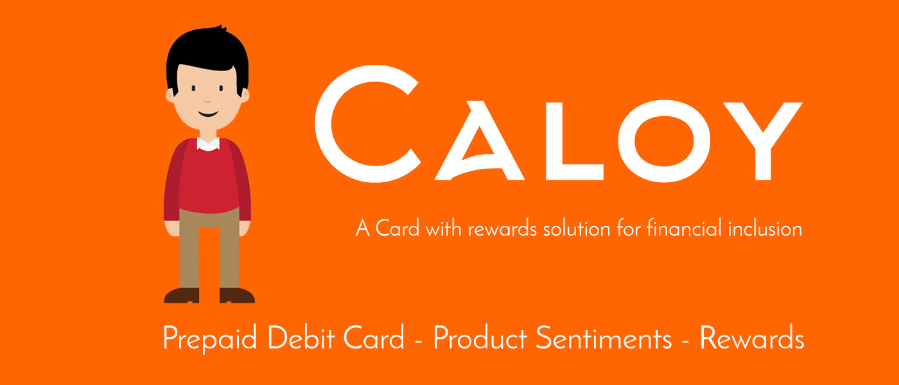

# CALOY
A service supporting financial inclusion and consumer empowerment

  
The Caloy Service has three features:
1. Prepaid Visa Debit Card (Caloy Card)
  - These cards can be bought from sari-sari stores and other retail stores. There will be two types of cards: savings and Top-up card.

2. Sentiment Analysis (Caloy Ask)
  - Caloy is capable of answering the user's query for a certain product
  
3. Rewards (Caloy Rewards)
  - For every top-up cards purchased, the customer is legible for claiming awards and coupons.
  
---Team HexDev
Arjun Araneta,
Ed Nemenzo,
Enrik Sabalvaro,
Julius Marco,

